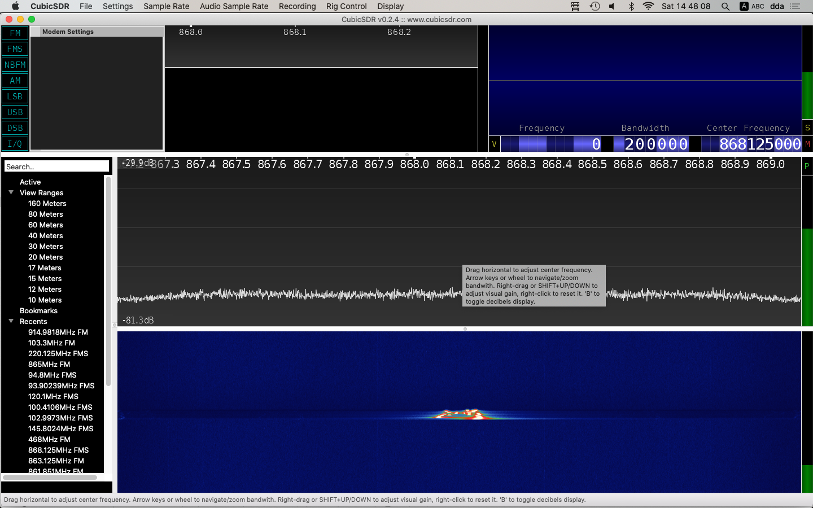

# RAK811

Le manuel AT Firmware est [ici](https://docs.rakwireless.com/Product-Categories/WisDuo/RAK811-Breakout-Board/AT-Command-Manual/#lora-p2p-type-at-command). En anglais mais complet et à jour. Une copie PDF d'une version un tantisoit plus ancienne est dans ce répo.

## Commandes de base :
* `at+set_config=lora:work_mode:1`

  **Mode LoRa P2P**

* `at+set_config=lorap2p:868125000:12:0:1:8:20`

 **Configuration radio**
   * 868.125 MHz
   * SF 12 (Long Range, slow)
   * BW 0 = 125 KHz (Long Range, slow. Pourrait être plus bas mais bon...)
   * CR 1 = 4/5 (touche à rien !)
   * Préambule : 8 octets
   * Tx power : 20 (On booste !)

* `at+set_config=lorap2p:transfer_mode:2`

  **Mode transmission**

* `at+send=lorap2p:30313233343536`

  **Envoi de "0123456" hex-encoded**

   (Python : `binascii.hexlify(b'0123456')`)

* `at+set_config=lorap2p:transfer_mode:1`

  **Mode réception**

Il faut donc changer de mode pour envoyer et recevoir, ce qui est peu testirompteur, mais on s'y fait. En fait le mieux est de mettre la puce en mode réception et de faire comme ci-dessus : mode transmission, envoi, mode réception.

